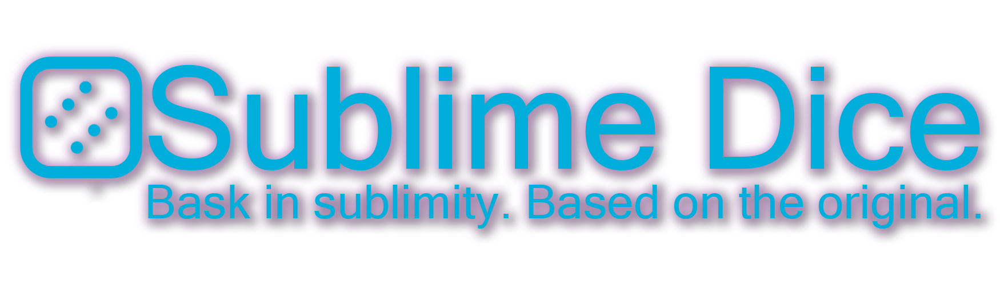

# Sublime Dice

  

Sublime Dice is a virtual dice-rolling game where perfection through simplicity is realized.

*Hark, one and all, and come to attend the grand unveiling of the Sublime Casino, where all are bid welcome, without prejudice or distinction. We entreat each soul to revel in mirth and merriment within these hallowed halls.*

*Herein lies an opportunity to amass a plenitude of coin, for fortune may favor those who partake. Let not desolation consume thee should thy final credit be forfeit, for a bountiful faucet awaits, wherein all may partake and prolong their jovial pursuits.*

*Pray not delay; we beseech thee to consider our establishment for thy everlasting amusement and pastime.*

## About
[sublimedice.com](https://sublimedice.com)

Based on, and an homage to PrimeDice, SublimeDice is a dice-rolling game. While simpler and more barebones than its predecessor, it is still yet equipped with features to implement a complete dice game:
* No actual gambling is occurring
    * SublimeDice uses a fictitious currency with no real-world monetary value
* Rolls are **provably fair**
    * Client seed can be changed for every game
    * Incrementing nonce tracks uses of each server seed
    * Players can rotate their seed pair at any time
    * Server seed is only revealed after rotating seed pair
* Personal profiles to track funds and bets
* Built-in house edge (1%)
* Automatic win-chance calculation and display
* Faucet for players to start anew after irrecoverable loss

## Download
Grab the [latest release](https://github.com/Jinnysia/SublimeDice/releases/latest) from the Releases page.

## How to Play
[Check out the website's tutorial here](https://sublimedice.com/#tutorial).

Every account starts with ¢500 Sublime Credits.

A player will set their wager: a prediction consisting of a numeric boundary and a direction. For example, "I predict the roll will be below 25." Alongside this, a player will provide the amount of credits they wish to wager.

When the game starts, a number between `0.00` and `99.99` (both inclusive) is rolled. If the rolled number is within the player's prediction, they win. The payout is a multiplier based on how "risky" their prediction was. If their win chance was ~50%, their payout is 2x. However, if their win chance was only 25%, then their payout increases to 4x.

Players are welcome and encouraged to verify their bets. If you are unfamiliar with the **provably fair** algorithm, feel free to [read this short article](https://sublimedice.com/#fairness).

If a player falls below ¢10 credits, they can utilize the **Faucet** which debits ¢100 into their account. This feature can only be used every 5 minutes.

## Planned Features
* Auto-roller
    * Strategy editor (Martingale, Delayed Martingale, Paroli, D 'Alembert, Labouchere, etc.)
* Roulette
* Blackjack

## Technologies
* [C# (.NET)](https://github.com/dotnet/runtime) + System.Text.Json
* [MetroModernUI](https://github.com/dennismagno/metroframework-modern-ui) for controls
* Server utilizing PHP v8, MySQL, Apache running on Ubuntu 22.04